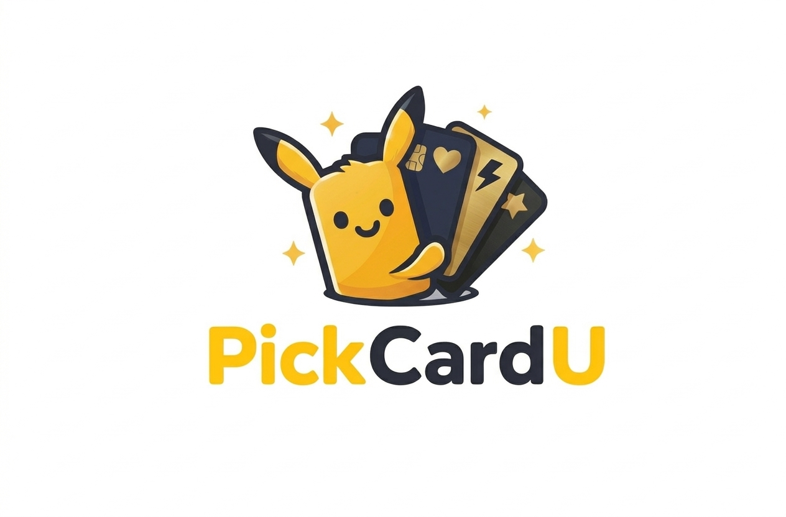
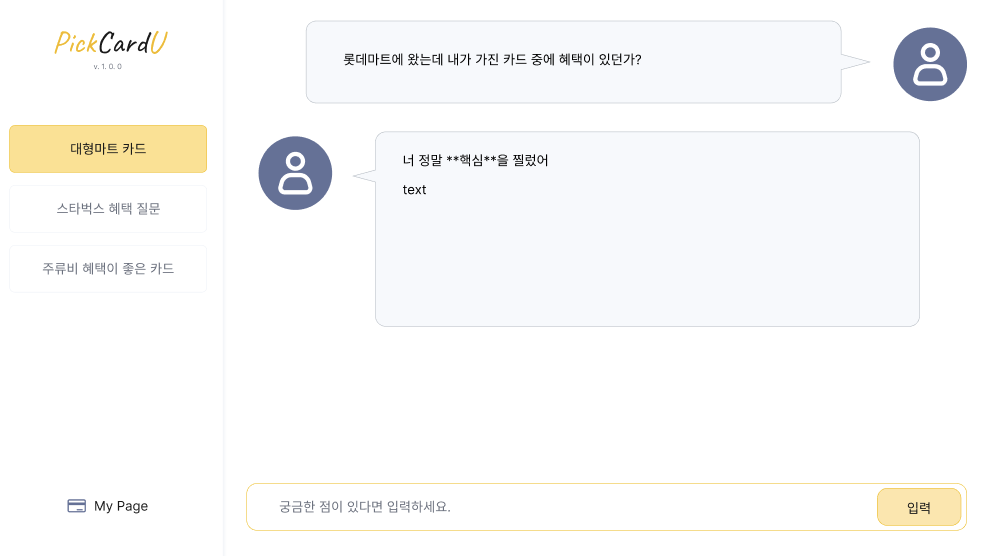
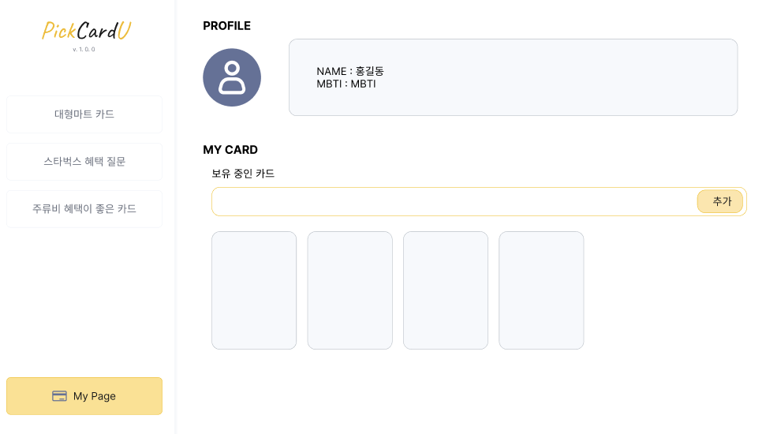
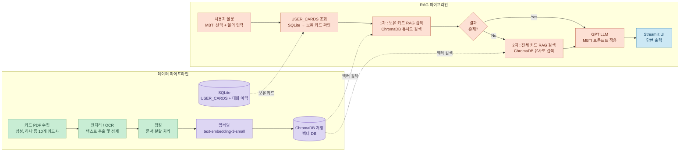
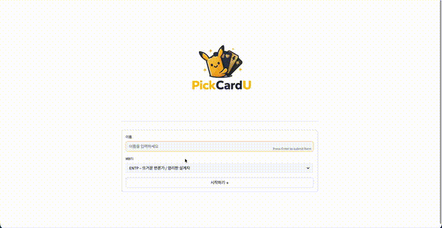
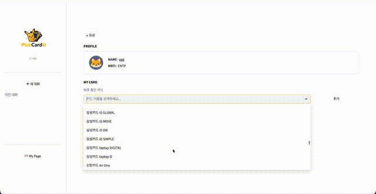
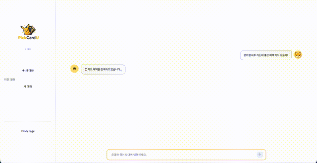
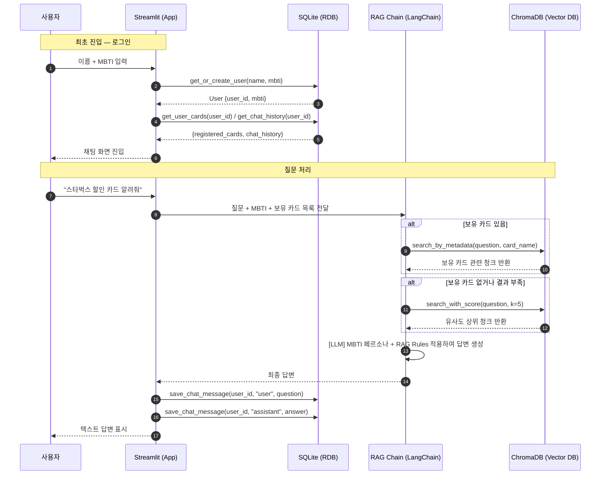
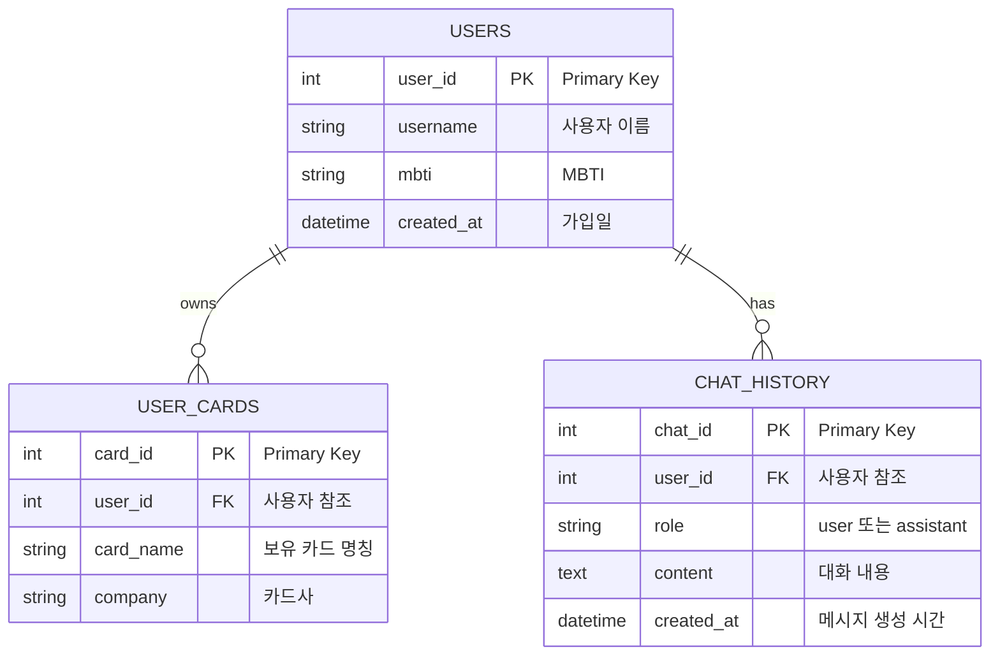

# PickCardU

<div align="center">
  
</div>

### MBTI 기반 개인 맞춤형 신용카드 큐레이션 RAG 챗봇

<br>

## 프로젝트 소개

> **"내 소비 패턴에 딱 맞는 카드, AI가 MBTI 말투로 추천해드립니다"**

신용카드 시장의 카드 수가 폭발적으로 증가하면서 소비자들이 자신에게 맞는 카드를 선택하기 어려운 환경이 되었습니다.
카드사별 혜택 구조가 복잡하고 다양하여 단순 비교가 어렵고, 개인의 소비 패턴과 성향에 맞는 맞춤형 카드 추천 서비스가 부재한 상황입니다.

**PickCardU**는 RAG(Retrieval-Augmented Generation) 기술로 카드 약관을 정확히 검색하고,
사용자의 MBTI 유형에 맞는 말투로 카드를 추천·설명해주는 개인 맞춤형 챗봇입니다.

<br>

## 프로젝트 기간

**2026.04.01 ~ 2026.04.07** (SK Networks AI Camp 25기 · 6팀 · 3차 미니 프로젝트)

<br>

## 팀원 소개

<table>
  <tr>
    <td align="center"></td>
    <td align="center"></td>
    <td align="center"></td>
    <td align="center"></td>
    <td align="center"></td>
  </tr>
  <tr>
    <td align="center"><b>박연정</b><br>팀장</td>
    <td align="center"><b>김서현</b><br>팀원</td>
    <td align="center"><b>박지현</b><br>팀원</td>
    <td align="center"><b>신문수</b><br>팀원</td>
    <td align="center"><b>이근혁</b><br>팀원</td>
  </tr>
  <tr>
    <td align="center"><a href="https://github.com/yeony-park">@yeony-park</a></td>
    <td align="center"><a href="https://github.com/bizseohyunkim">@bizseohyunkim</a></td>
    <td align="center"><a href="https://github.com/qkrwlgus89">@qkrwlgus89</a></td>
    <td align="center"><a href="https://github.com/anstn3375">@anstn3375</a></td>
    <td align="center"><a href="https://github.com/keunlee726">@keunlee726</a></td>
  </tr>
  <tr>
    <td align="center">테크 리드<br>데이터수집(신한, IBK)<br>MBTI 프롬프트(INFP)<br>Docker 환경세팅 · UI/UX</td>
    <td align="center">데이터수집(삼성, 하나)<br>MBTI 프롬프트(INTP)<br>임베딩 & 벡터DB 저장<br>PPT 제작</td>
    <td align="center">데이터수집(현대, 국민)<br>프롬프트 엔지니어링<br>PPT 제작 · 발표</td>
    <td align="center">데이터수집(NH, BC)<br>MBTI 프롬프트(ISFJ)<br>PDF OCR<br>데이터 로드/청킹</td>
    <td align="center">데이터수집(우리, 롯데)<br>MBTI 프롬프트(INTJ)<br>프롬프트 테스트/개선<br>SQLite DB · 발표</td>
  </tr>
</table>

<br>

## 주제 선정 배경

- 하루에 1.4장씩 단종되는 카드 시장 → 소비자가 최신 혜택을 일일이 파악하기 어려움
- 카드사별 혜택 구조가 복잡하고 다양하여 단순 비교가 어려움
- 개인의 소비 패턴과 성향에 맞는 맞춤형 카드 추천 서비스 부재

**→ RAG 기반 LLM으로 hallucination 없이 실제 카드 데이터에 기반한 신뢰성 높은 큐레이션 서비스 구현**  
**→ MBTI 성향별 맞춤 프롬프트로 사용자 친화적인 개인화 응답 제공**

<br>

## 주요 기능

| 기능 | 설명 |
|------|------|
| 카드 추천 | 사용자 질문 + 보유 카드 기반 맞춤 카드 추천 |
| MBTI 말투 | 16가지 MBTI 페르소나로 개인화된 답변 제공 |
| 카드 등록 | 보유 카드 등록 후 혜택 비교 가능 |
| 카드 Q&A | 카드 약관 기반 정확한 혜택 질의응답 (RAG) |
| 대화 이력 | 사용자별 채팅 히스토리 저장 |

<br>

## UI 와이어프레임

| 채팅 화면 | 마이페이지 |
|:-:|:-:|
|  |  |

<br>

## 시스템 아키텍처



<br>

## 데이터 파이프라인

**10개 카드사 공식 홈페이지**에서 카드 상품 설명서 PDF를 수집하여 처리합니다.

| 단계 | 도구 | 설명 |
|------|------|------|
| PDF 수집 | - | 삼성, 하나, BC, 신한, 현대, 국민, NH, 우리, 롯데, IBK |
| 전처리/OCR | PyPDF, EasyOCR | 텍스트 추출 및 정제 |
| 청킹 | LangChain TextSplitter | chunk_size=800, overlap=120 |
| 임베딩 | OpenAI text-embedding-3-small | 벡터 변환 |
| 벡터 저장 | ChromaDB PersistentClient | 유사도 검색 |

<br>

## 핵심 기능 구현

### 임베딩 & ChromaDB
- `text-embedding-3-small` 모델로 벡터 변환 및 저장
- LangChain 연동, PersistentClient 사용
- 유사도 기반 검색

### RAG 검색 전략
- 유사도 검색 (similarity)
- 카드명 그룹화 및 키워드 필터링
- 배치 검색 + LRU 캐시 적용

### SQLite (사용자 데이터 관리)
- 사용자 생성 및 MBTI 등록/수정 (`get_or_create_user`, `update_user_mbti`)
- 보유 카드 등록/삭제/조회 (`add_user_card`, `remove_user_card`, `get_user_cards`)
- 대화 이력 저장/조회/초기화 (`save_chat_message`, `get_chat_history`, `clear_chat_history`)
- SQLAlchemy ORM + SessionLocal 기반 CRUD

### MBTI 기반 프롬프트 엔지니어링
- 16가지 MBTI 페르소나 개인화 답변 스타일
- Hallucination 방지 (context 내 정보만 사용)
- GPT-4o 연동

<br>

## 기술 스택

### Frontend


### Backend


### Database / Infra


### Tools


<br>

## 시연 영상

### 사용자 설정
초기 화면에서 사용자 이름과 MBTI를 설정할 수 있습니다.



### 보유 카드 등록 및 우선 추천
My Page에서 보유 중인 카드를 등록할 수 있으며, 질문 시 보유 카드의 혜택을 우선으로 답변합니다.



### 카드 혜택 질의응답
채팅으로 궁금한 내용을 질문하면 RAG 기반으로 카드 혜택 답변을 받을 수 있습니다.



<br>

## 시퀀스 다이어그램



<br>

## ERD



<br>

## 프로젝트 구조

```
SKN25-3rd-6Team/
├── app.py                  # Streamlit 메인 앱
├── docker-compose.yml      # Docker 설정
├── Dockerfile
├── requirements.txt
├── .env                    # 환경변수 (git 제외)
├── .gitignore
│
├── src/                    # 핵심 모듈
│   ├── data_loader.py      # PDF 문서 로딩
│   ├── chunking.py         # 텍스트 청킹
│   ├── embedding.py        # 임베딩 & ChromaDB 저장
│   ├── Easyocr.py          # EasyOCR 처리
│   ├── ocr.py              # GPT Vision OCR
│   ├── retrieval.py        # 검색 전략
│   ├── templates.py        # 프롬프트 템플릿
│   └── db/                 # SQLite CRUD
│       ├── __init__.py
│       ├── crud.py
│       ├── database.py
│       ├── init_db.py
│       └── models.py
│
├── data/
│   ├── clean_data/         # 전처리된 PDF
│   ├── raw/                # 원본 PDF
│   └── ocr_output/         # OCR 결과 txt
│
├── chroma_db/              # 벡터 DB 저장소
├── sqlite_db/              # SQLite DB 저장소
├── prompts/
│   ├── prompts.yml         # MBTI 프롬프트
│   └── rag_rules.yml       # RAG 규칙
└── assets/                 # 이미지 등 정적 파일
```

<br>

## 실행 방법

### 환경변수 설정

`.env` 파일을 루트에 생성하고 아래 내용을 입력하세요:

```env
OPENAI_API_KEY=your_openai_api_key_here
```

---

### Docker로 실행 (권장)

```bash
# 1. 레포지토리 클론
git clone https://github.com/SKNETWORKS-FAMILY-AICAMP/SKN25-3rd-6Team.git
cd SKN25-3rd-6Team

# 2. 이미지 빌드 및 컨테이너 실행
docker-compose up --build -d

# 3. 카드 PDF를 data/clean_data/ 또는 data/ocr_output/ 에 넣은 후 임베딩 실행
docker-compose exec app python src/embedding.py

# 4. 브라우저에서 http://localhost:8501 접속
```

> `chroma_db`, `sqlite_db`, `data`, `src`, `prompts`, `assets` 디렉토리는 로컬과 마운트되어 공유됩니다.

---

### 로컬에서 실행

```bash
# 1. 레포지토리 클론
git clone https://github.com/SKNETWORKS-FAMILY-AICAMP/SKN25-3rd-6Team.git
cd SKN25-3rd-6Team

# 2. 가상환경 생성 및 활성화
python -m venv .venv

# Windows
.\.venv\Scripts\activate
# Mac/Linux
source .venv/bin/activate

# 3. 패키지 설치
pip install -r requirements.txt

# 4. 카드 PDF를 data/clean_data/ 또는 data/ocr_output/ 에 넣은 후 임베딩 실행
python src/embedding.py

# 5. Streamlit 실행
streamlit run app.py
```

<br>

## src 모듈 설명

| 파일 | 설명 |
|------|------|
| `data_loader.py` | `clean_data` 폴더의 PDF를 파일 단위 Document로 로딩 |
| `chunking.py` | RecursiveCharacterTextSplitter로 텍스트 청킹 (chunk_size=800, overlap=120) |
| `embedding.py` | OpenAI `text-embedding-3-small`로 임베딩 후 ChromaDB 저장 |
| `Easyocr.py` | EasyOCR로 이미지형 PDF 텍스트 추출 및 txt 저장 |
| `ocr.py` | GPT-4 Vision API로 PDF 페이지 OCR |
| `retrieval.py` | 보유 카드 메타데이터 필터링 + 유사도 fallback 검색 |
| `templates.py` | MBTI별 시스템 프롬프트 + RAG 규칙 체인 구성 |
| `db/models.py` | SQLAlchemy ORM 모델 정의 (User, UserCard, ChatHistory) |
| `db/crud.py` | 사용자·카드·대화이력 CRUD 함수 |
| `db/database.py` | SQLite 엔진 및 세션 설정 |

<br>

## 회고

> **박연정** — 팀원 모두가 각자 맡은 역할에 최선을 다해준 덕분에 3차 프로젝트를 잘 마무리할 수 있었습니다. 도커 환경을 세팅하는 과정에서 requirements 수정이 자주 발생했고, 그때마다 이미지를 다시 빌드해야 해서 팀원들에게 미안하기도 했습니다. 하지만 RAG의 전체 구조를 하나로 연결하고, 최종 결과물이 의도한 대로 동작하는 것을 보면서 큰 보람을 느꼈습니다. 특히 MBTI 프롬프트를 설계하는 과정에서는 프롬프트가 무조건 길다고 좋은 것이 아니라는 점을 깨달았고, 프롬프트에 따라 결과가 크게 달라질 수 있다는 것을 직접 경험할 수 있었습니다.

> **김서현** — 팀원 각자가 카드사 데이터를 수집하고 전처리하는 과정에서 실제 금융 데이터의 복잡성을 체감했습니다. RAG 파이프라인을 직접 구축하며 단순 LLM 활용을 넘어 hallucination을 줄이는 것이 얼마나 중요한지 깨달았습니다. 16가지 MBTI 프롬프트를 설계하면서 같은 정보도 전달 방식에 따라 사용자 경험이 크게 달라진다는 점이 인상적이었습니다. 짧은 기간이었지만 데이터 수집부터 임베딩, 검색, UI까지 전체 AI 서비스 파이프라인을 경험할 수 있었던 값진 프로젝트였습니다.

> **박지현** — LLM을 활용하여 프롬프트 엔지니어링을 해보며, 이전에 GPT 내부에서 프롬프트 작성을 통해 만들었던 챗봇보다 완성도 높은 챗봇을 만든 경험이 색달랐습니다. AI 서비스 파이프라인 전 과정에 참여할 수 있어 뜻깊었습니다.

> **신문수** — 평상시 사용해왔던 LLM 서비스를 직접 구축해볼 수 있어서 유익한 시간이었습니다. OCR 적용 후 전처리와 청크 작업을 하면서 데이터의 질이 큰 비중을 차지한다는것을 느꼈습니다.

> **이근혁** — 그동안 쉽게 이용했던 LLM 서비스를 활용해서 서비스를 직접 만들어 볼 수 있는 프로젝트를 진행할 수 있어서 유의미했습니다. 이번 프로젝트도 잘 이끌어주는 팀장님과 믿고 따르는 팀원들과 함께할 수 있어서 즐겁게 진행했습니다.

<br>

---

<div align="center">
  <b>SK Networks AI Camp 25기 · 6팀 · 3차 미니 프로젝트</b><br>
  <i>Our journey continues...</i>
</div>
